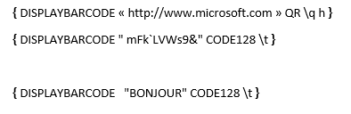

+++
title = 'Codes Barre Word'
date = 2021-11-12T10:09:02+02:00
draft = false
+++
Impression de codes à barre dans Word

vendredi, 12 novembre 2021

10:09

 

# Pour imprimer un code barre dans Word:

 

Presser CTRL-F9

Mettre le code { DISPLAYBARCODE « <http://www.microsoft.com> » QR \\q h
} entre les accolades créées par Ctrl-F9

Click droit \"Basculer les codes de champs\" pour passer du texte au
code barre

{width="5.59375in"
height="4.875in"}

Textes correspondants aux codes barre ci-dessus:

{width="4.09375in"
height="1.3333333333333333in"}

 

# Publispostage

Pour faire du publipostage, p.ex impression d\'étiquettes, utiliser
MERGEBARCODE au lieu de DISPLAYBARCODE et mettre le nom du champ au lieu
du texte.

 

# vCard

{ DISPLAYBARCODE \"BEGIN:VCARD

VERSION:3.0

N:Boudry;Olivier;;;

FN:Olivier Boudry

ORG:Marvinpac;

EMAIL;type=INTERNET;type=pref:olivier.boudry@marvinpac.com

TEL;type=HOME;type=VOICE;type=pref:+41 21 925 55 53

TEL;type=CELL;type=VOICE:+41 79 399 13 32

item1.ADR;type=WORK;type=pref:;;Chemin de la Crêta
80;Châtel-St-Denis;;1618;Suisse

item1.X-ABADR:ch

END:VCARD\" QR \\q 3 \\s 50}

 

 

<https://support.microsoft.com/en-us/office/field-codes-displaybarcode-6d81eade-762d-4b44-ae81-f9d3d9e07be3>
